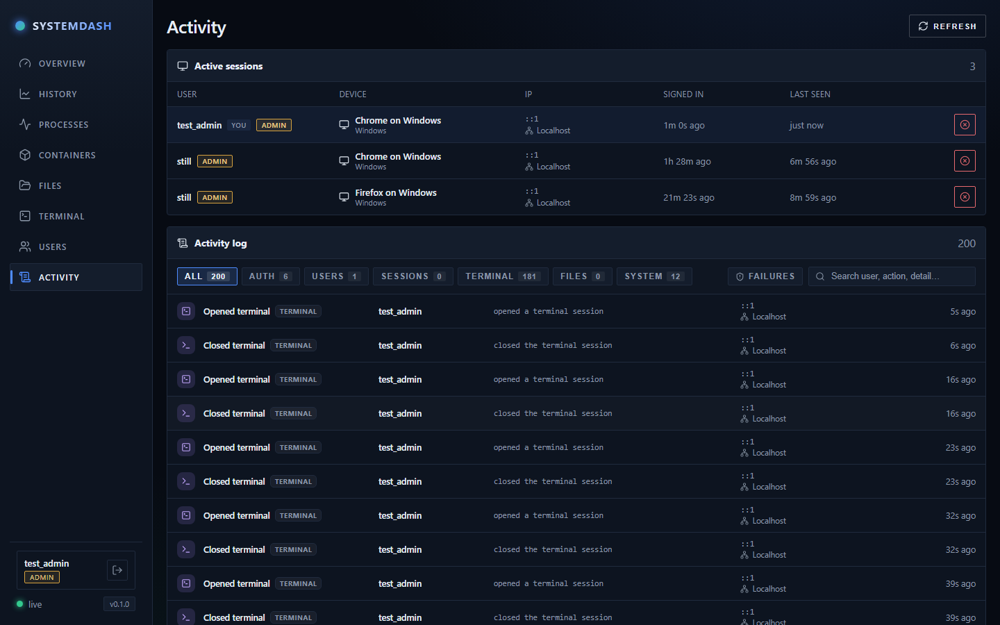

# Beacon

A self-hosted, cross-platform (Windows / Linux / macOS) host console. It exposes
live OS stats through a web UI: CPU model & load & clock speed, memory, storage, GPU,
and OS/host info. Files, terminal, containers, projects, and power control live in
the same console.

Install paths, the `systemdash` systemd unit, and `SYSTEMDASH_*` environment variables
keep their existing names so upgrades stay compatible.

## Screenshots

**Overview** — live CPU, memory, storage, and GPU stats at a glance:


**History** — time-series charts of CPU, memory, and GPU metrics over selectable ranges:


**Processes** — sortable, filterable process list grouped into apps and background tasks:


**Containers** — Docker status, container list, logs, and start/stop controls:


**Files** — browse drives, navigate folders, and manage files:


**Terminal** — multi-tab local shell with scrollback kept per tab:


**Activity** — active sessions and audit log (admin):



## Stack

- **Frontend:** React + TypeScript + Vite (`web/`)
- **Backend:** Node.js + Express + TypeScript with [`systeminformation`](https://systeminformation.io/) (`server/`)
- **Monorepo** managed with Yarn workspaces.

## Requirements

- Node.js 18+ (tested on Node 24)
- Yarn 1.x (classic)

## Develop

```bash
yarn install
yarn dev
```

- Web UI (with hot reload): http://localhost:5273
- API server: http://localhost:3001 (the web dev server proxies `/api` to it)

## Production / single-host

```bash
yarn build   # builds the web UI and compiles the server
yarn start   # serves API + built UI from http://localhost:3001
```

Set a custom port with the `PORT` env var.

**Linux server (releases):** push a tag → CI builds
`systemdash-<version>-linux-x64.tar.gz` → server installs with
[docs/deploy-linux.md](docs/deploy-linux.md). No build tools on the server. In-app
**Update** button (download latest release) is planned next.

## API

Read:

- `GET /api/health` → `{ ok: true }`
- `GET /api/system` → full system snapshot (host, cpu, memory, disks, gpus)
- `GET /api/processes` → running processes
- `GET /api/fs/roots` → drives / home
- `GET /api/fs/list?path=…` → directory listing
- `GET /api/fs/dirsize?path=…` → recursive folder size
- `GET /api/fs/download?path=…` → download a file

Write (file management):

- `POST /api/fs/folder` `{ path, name }` → create a folder
- `POST /api/fs/file` `{ path, name }` → create an empty file
- `POST /api/fs/rename` `{ path, newName }` → rename
- `POST /api/fs/move` `{ path, dest }` → move into directory `dest`
- `POST /api/fs/copy` `{ path, dest }` → copy into directory `dest`
- `POST /api/fs/delete` `{ path }` → delete a file or folder (recursive)
- `POST /api/fs/upload?dir=…&name=…` (raw body) → stream a file to disk

Editor:

- `GET /api/fs/read?path=…` → read a text file (rejects directories, >5 MB, or binary)
- `POST /api/fs/write` `{ path, content }` → save text content to a file

Settings:

- `GET /api/settings` / `PUT /api/settings` → file-manager preferences, persisted to
  `~/.systemdash/settings.json` (override dir with `SYSTEMDASH_DATA_DIR`)

Authentication & users:

- `GET /api/auth/status` → `{ needsSetup, user }` (drives first-run vs login vs app)
- `POST /api/auth/setup` `{ username, password }` → create the first admin (only
  works while no users exist) and start a session
- `POST /api/auth/login` `{ username, password }` → start a session
- `POST /api/auth/logout` → end the current session
- `GET /api/auth/me` → the currently signed-in user
- `GET /api/users` / `POST /api/users` / `PATCH /api/users/:id` / `DELETE /api/users/:id`
  → user management (admin only): create/edit roles, reset passwords, enable/disable, delete

Terminal:

- `WS /api/terminal` → interactive shell session (PowerShell on Windows, `$SHELL`
  elsewhere). Keystrokes stream to the shell; output streams back.

Docker (requires Docker Engine / Docker Desktop on the host; Beacon itself stays
native, not containerised):

- `GET /api/docker/status` → `{ available, version, error }`
- `GET /api/docker/containers` → list all containers
- `GET /api/docker/containers/:id/logs?tail=300` → recent log output
- `POST /api/docker/containers/:id/start|stop|restart` → control (`user`/`admin`)

### Testing the Containers tab

1. Install and start [Docker Desktop](https://www.docker.com/products/docker-desktop/)
   (Windows/macOS) or Docker Engine (Linux).
2. In a terminal (or the Beacon **Terminal** tab), run a throwaway container:

   ```bash
   docker run -d --name systemdash-test -p 8080:80 nginx:alpine
   ```

3. Open **Containers** in the sidebar — you should see `systemdash-test` running.
4. Try **Logs**, **Stop**, **Start**, and **Restart**. Visit http://localhost:8080 to
   confirm nginx is serving while running.
5. Clean up when done: `docker rm -f systemdash-test`

If Docker is installed but the tab says “not available”, ensure Docker Desktop is
running and that the account starting Beacon can access the Docker socket (on Linux,
add your user to the `docker` group or run elevated). Override the CLI path with
`DOCKER_BIN` if needed.

## Notes

- Some metrics (CPU temperature, GPU utilization) depend on OS/driver support and may
  be `null` where the platform does not expose them. On Linux, run with appropriate
  permissions for full temperature/disk detail.
- **File access & permissions:** the server reads and writes the disk **as the OS user
  that started it**. Folders that account can't touch return `permission denied`. To see
  into / modify protected system locations, launch the server elevated (Run as
  Administrator on Windows, `sudo` on Linux/macOS).
- **Authentication & roles:** every `/api` endpoint (except `/api/health`) and the
  terminal WebSocket now require a signed-in user. On first launch the UI shows a
  one-time setup screen to create the admin account (no default password is shipped).
  Users have one of three roles:
  - `viewer` — read-only (overview, history, process list, browse/read/download files)
  - `user` — viewer plus write actions (file create/edit/upload/delete, terminal)
  - `admin` — everything plus user management
  Accounts and sessions are stored in a local SQLite file at `~/.systemdash/auth.db`
  (override the dir with `SYSTEMDASH_DATA_DIR`). Passwords are hashed with scrypt;
  sessions are opaque tokens kept in an HttpOnly, SameSite=Lax cookie (marked `Secure`
  automatically over HTTPS). Run behind HTTPS (e.g. a reverse proxy) when exposing it
  beyond localhost.
- **Privilege model — the dashboard runs with full host clearance:** Beacon is the
  server's control interface and never drops privileges. It reads/writes the disk, runs
  the terminal, and ends/kills processes **as the OS account that started it**. Launch it
  as a normal user and it's confined to that user; launch it elevated (Administrator on
  Windows, root via `sudo`/systemd on Linux) and a signed-in `user`/`admin` can do
  anything that account can on the machine — kill any process, touch any file, run any
  command. This is intentional, but it means the in-app roles are your only guardrail, so
  grant `user`/`admin` carefully and keep it behind HTTPS + strong passwords.
- **Process control:** the Processes tab lets `user`/`admin` accounts **End** (graceful:
  `taskkill` / `SIGTERM`) or **Force kill** (`taskkill /F /T` / `SIGKILL`) any process.
  The only thing it refuses to terminate is its own server process, to avoid taking down
  the interface from inside itself. Every termination is recorded in the activity log.
- **Terminal:** it allocates a real PTY (via `node-pty`), so the shell behaves like a
  native terminal — arrow-key history, `Ctrl+C` to interrupt the foreground process,
  `clear`/`cls`, and full-screen TUI programs (vim, htop, less) all work. SSH to remote
  hosts can be added later.

## Roadmap

- **Code editor** — replace the plain textarea with a proper editor (syntax highlighting,
  line numbers, bracket matching; Monaco or CodeMirror). Keep the existing read/write API;
  broaden supported file types beyond plain `.txt` where the server already allows edits.
- **Docker** — container overview and control (list/start/stop/restart, logs) via the
  Docker CLI on the host. Detect whether Docker is installed; gate mutating actions
  behind `user`/`admin`. Compose stacks and image creation remain future work.
- **Scheduled jobs** — in-app cron-style tasks (e.g. restart a container nightly, run a
  backup script). Not a replacement for OS autostart (`systemd` / Task Scheduler); those
  remain the way to boot Beacon itself.
- **Email & alerts** — optional verified email per user; per-user notification
  preferences (e.g. login/logout, failed login, new session/IP, terminal connect,
  file delete, process kill). Dispatch from the existing audit log via admin-configured
  SMTP or an email API (Resend, SendGrid, etc.). Start with security-focused events;
  terminal-command alerts opt-in and filterable to avoid noise.
- **SSH** — connect to remote hosts from the built-in terminal.
- **Deployment helpers** — GitHub Actions release builds (precompiled linux-x64 tarball);
  server install via `scripts/install-release.sh` (Node.js only, no on-host build).
  Planned: in-app update check + one-click install from latest GitHub Release.
- **Security** — TOTP 2FA (authenticator apps); CSRF hardening when exposed beyond a
  trusted LAN. Optional OAuth (Google / Apple) later for sign-in convenience once a
  public HTTPS callback URL is available (e.g. via Cloudflare Tunnel).
