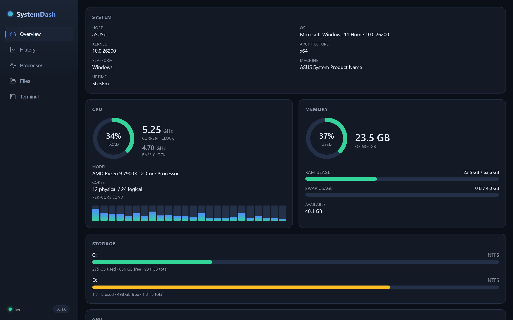
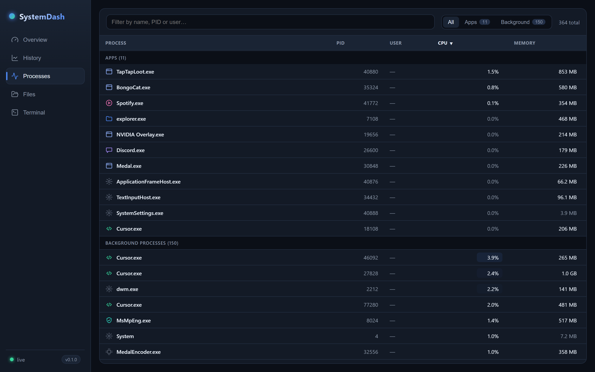
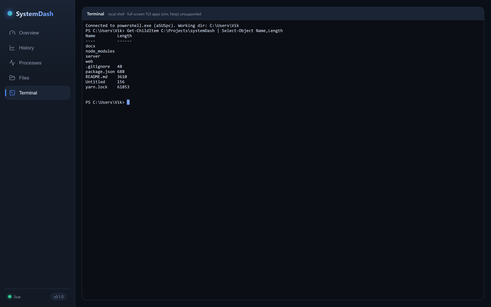

# SystemDash

A self-hosted, cross-platform (Windows / Linux / macOS) system dashboard. It exposes
live OS stats through a web UI: CPU model & load & clock speed, memory, storage, GPU,
and OS/host info.

## Screenshots

**Overview** — live CPU, memory, storage, and GPU stats at a glance:



**History** — time-series charts of CPU, memory, and GPU metrics over selectable ranges:


**Processes** — sortable, filterable process list grouped into apps and background tasks:



**Files** — browse drives, navigate folders, and manage files:


**Terminal** — an interactive shell session right in the browser:



## Stack

- **Frontend:** React + TypeScript + Vite (`web/`)
- **Backend:** Node.js + Express + TypeScript with [`systeminformation`](https://systeminformation.io/) (`server/`)
- **Monorepo** managed with Yarn workspaces.

## Requirements

- Node.js 18+ (tested on Node 24)
- Yarn 1.x (classic)

## Develop

```bash
yarn install
yarn dev
```

- Web UI (with hot reload): http://localhost:5173
- API server: http://localhost:3001 (the web dev server proxies `/api` to it)

## Production / single-host

```bash
yarn build   # builds the web UI and compiles the server
yarn start   # serves API + built UI from http://localhost:3001
```

Set a custom port with the `PORT` env var.

## API

Read:

- `GET /api/health` → `{ ok: true }`
- `GET /api/system` → full system snapshot (host, cpu, memory, disks, gpus)
- `GET /api/processes` → running processes
- `GET /api/fs/roots` → drives / home
- `GET /api/fs/list?path=…` → directory listing
- `GET /api/fs/dirsize?path=…` → recursive folder size
- `GET /api/fs/download?path=…` → download a file

Write (file management):

- `POST /api/fs/folder` `{ path, name }` → create a folder
- `POST /api/fs/file` `{ path, name }` → create an empty file
- `POST /api/fs/rename` `{ path, newName }` → rename
- `POST /api/fs/move` `{ path, dest }` → move into directory `dest`
- `POST /api/fs/copy` `{ path, dest }` → copy into directory `dest`
- `POST /api/fs/delete` `{ path }` → delete a file or folder (recursive)
- `POST /api/fs/upload?dir=…&name=…` (raw body) → stream a file to disk

Editor:

- `GET /api/fs/read?path=…` → read a text file (rejects directories, >5 MB, or binary)
- `POST /api/fs/write` `{ path, content }` → save text content to a file

Settings:

- `GET /api/settings` / `PUT /api/settings` → file-manager preferences, persisted to
  `~/.systemdash/settings.json` (override dir with `SYSTEMDASH_DATA_DIR`)

Terminal:

- `WS /api/terminal` → interactive shell session (PowerShell on Windows, `$SHELL`
  elsewhere). Keystrokes stream to the shell; output streams back.

## Notes

- Some metrics (CPU temperature, GPU utilization) depend on OS/driver support and may
  be `null` where the platform does not expose them. On Linux, run with appropriate
  permissions for full temperature/disk detail.
- **File access & permissions:** the server reads and writes the disk **as the OS user
  that started it**. Folders that account can't touch return `permission denied`. To see
  into / modify protected system locations, launch the server elevated (Run as
  Administrator on Windows, `sudo` on Linux/macOS).
- **Security:** the file-management, editor, and **terminal** endpoints are **not
  authenticated**. The terminal in particular grants full command execution on the host
  as the server's user — only run this on a trusted host/network (it binds to localhost
  by default). Add the admin login before exposing it anywhere.
- **Terminal limitations:** it pipes a shell rather than allocating a real PTY, so
  full-screen TUI programs (vim, htop, less) won't render correctly. Ordinary commands,
  output streaming, prompts and line editing work. A real PTY (node-pty) or SSH for
  remote hosts can be added later.

## Roadmap

- Admin authentication to gate the write / file-management / terminal endpoints.
- Real PTY terminal (node-pty) + SSH to remote hosts.
- Historical charts / time-series.
